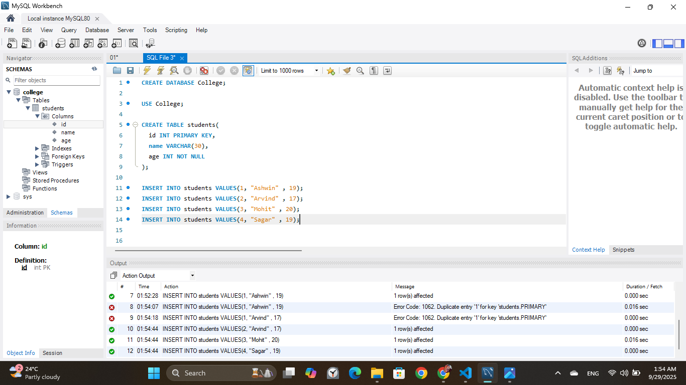

## Create First Database Table 

Step: 1 

```markdown
USE db_name
```

<hr>

Step: 2

```markdown
CREATE TABLE table_name(
    column_name_1 datatype constraint,
    column_name_2 datatype constraint,
    column_name_3 datatype constraint
);
```

<hr>

Example :

```markdown
USE College;
```

```markdown
CREATE TABLE students(
  id INT PRIMARY KEY,
  name VARCHAR(30),
  age INT NOT NULL
);
```

First We a define Columns
Like id, name ,age


## 🗂️ Table: `Users`

| id | name    | age |
|----|---------|-----|
|    |         |     |
|    |         |     |
|    |         |     |
----------------------

### 📄 Column Descriptions

- **id**: `INT` — Unique identifier for each user (Primary Key)
- **name**: `VARCHAR(100)` — Name of the user
- **age**: `INT` — Age of the user

<hr>


<hr>

## Insert Data into the Table

### 📝 Insert Data into `Users` Table

### Method 1 

```markdown
INSERT INTO Users (id, name, age) VALUES
(1, 'Alice', 25),
(2, 'Bob', 30),
(3, 'Charlie', 28);
```
<hr>

### Method 2

```markdown
INSERT INTO students VALUES(1, "Ashwin" , 19);
INSERT INTO students VALUES(2, "Arvind" , 17);
INSERT INTO students VALUES(3, "Mohit" , 20);
INSERT INTO students VALUES(4, "Sagar" , 19);
```


<hr>


---

### 🔎 What This Does:

- Inserts three rows into the `Users` table.
- Each row includes:
  - `id` (an integer),
  - `name` (a string),
  - `age` (an integer).

## 🗂️ Table: `Users`

| id | name    | age |
|----|---------|-----|
| 1  | Alice   | 25  |
| 2  | Bob     | 30  |
| 3  | Charlie | 28  |


<hr>



<hr>

## Show table 

```markdown
SELECT * FROM students;
```


# 📊 SQL Data Types with Examples

SQL supports various data types, grouped into categories. Here are the most common ones with examples:

---

## 1. 🔢 Numeric Data Types

| Data Type | Description                  | Example           |
|-----------|------------------------------|-------------------|
| `INT`     | Integer numbers              | `25`, `-100`      |
| `FLOAT`   | Floating-point numbers       | `3.14`, `-0.5`    |
| `DECIMAL(p, s)` | Fixed precision         | `DECIMAL(5,2)` → `123.45` |
| `SMALLINT`| Smaller range of integers    | `32000`           |
| `BIGINT`  | Larger range of integers     | `9223372036854775807` |

---

## 2. 📝 String/Text Data Types

| Data Type    | Description                    | Example             |
|--------------|--------------------------------|---------------------|
| `CHAR(n)`    | Fixed-length string            | `CHAR(5)` → `'Hi  '` |
| `VARCHAR(n)` | Variable-length string         | `VARCHAR(100)` → `'Alice'` |
| `TEXT`       | Large text data                | `'This is a long note.'` |

---

## 3. 📅 Date & Time Data Types

| Data Type     | Description                  | Example                  |
|---------------|------------------------------|--------------------------|
| `DATE`        | Stores date only             | `'2025-09-29'`           |
| `TIME`        | Stores time only             | `'14:30:00'`             |
| `DATETIME`    | Stores date and time         | `'2025-09-29 14:30:00'`  |
| `TIMESTAMP`   | Stores date & time with zone | `'2025-09-29 14:30:00+00'` |

---

## 4. ✅ Boolean Data Type

| Data Type | Description         | Example   |
|-----------|---------------------|-----------|
| `BOOLEAN` | True or false values | `TRUE`, `FALSE` |

---

## 5. 📦 Example Table Using Various Data Types

```sql
CREATE TABLE Employees (
    id INT PRIMARY KEY,
    name VARCHAR(100),
    salary DECIMAL(10,2),
    birth_date DATE,
    is_active BOOLEAN
);
```


# 🧩 Types of SQL Commands

SQL commands are categorized into **five main types**, each serving a specific purpose in database operations.

---

## 1. 📄 DDL – Data Definition Language

These commands define the structure of a database (tables, schemas, etc.).

| Command     | Description                           | Example |
|-------------|---------------------------------------|---------|
| `CREATE`    | Creates a new table or database       | `CREATE TABLE Users (...);` |
| `ALTER`     | Modifies an existing table structure  | `ALTER TABLE Users ADD age INT;` |
| `DROP`      | Deletes a table or database           | `DROP TABLE Users;` |
| `TRUNCATE`  | Removes all records from a table      | `TRUNCATE TABLE Users;` |

---

## 2. ✏️ DML – Data Manipulation Language

These commands are used to manage data within tables.

| Command    | Description                    | Example |
|------------|--------------------------------|---------|
| `INSERT`   | Adds new records               | `INSERT INTO Users VALUES (1, 'Alice', 25);` |
| `UPDATE`   | Modifies existing records      | `UPDATE Users SET age = 26 WHERE id = 1;` |
| `DELETE`   | Removes records                | `DELETE FROM Users WHERE id = 1;` |

---

## 3. 🔍 DQL – Data Query Language

Used to fetch data from the database.

| Command   | Description           | Example |
|-----------|-----------------------|---------|
| `SELECT`  | Retrieves data         | `SELECT * FROM Users;` |

---

## 4. 🔐 DCL – Data Control Language

Used to control access to data.

| Command   | Description                      | Example |
|-----------|----------------------------------|---------|
| `GRANT`   | Gives user access privileges     | `GRANT SELECT ON Users TO user1;` |
| `REVOKE`  | Removes access privileges        | `REVOKE SELECT ON Users FROM user1;` |

---

## 5. 🔁 TCL – Transaction Control Language

Manages transactions in a database (used with DML).

| Command     | Description                            | Example |
|-------------|----------------------------------------|---------|
| `COMMIT`    | Saves all changes                      | `COMMIT;` |
| `ROLLBACK`  | Reverts changes if something goes wrong| `ROLLBACK;` |
| `SAVEPOINT` | Sets a point to roll back to           | `SAVEPOINT sp1;` |

---

## 📝 Example SQL Transaction

```sql
BEGIN;

INSERT INTO Users (id, name, age) VALUES (4, 'Diana', 22);

SAVEPOINT before_update;

UPDATE Users SET age = 23 WHERE id = 4;

ROLLBACK TO before_update;

COMMIT;
```


