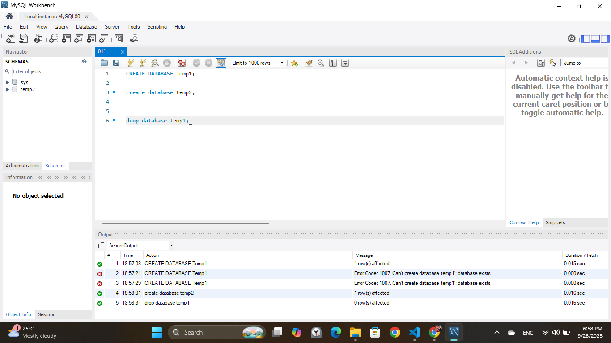
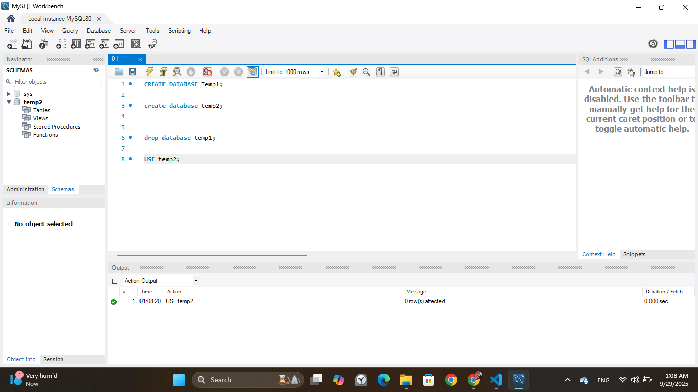
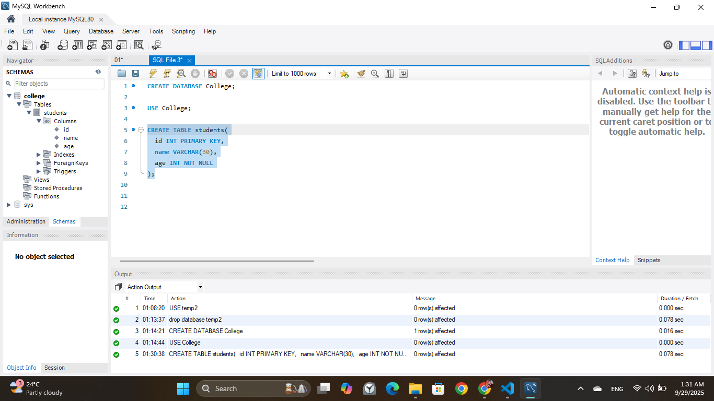
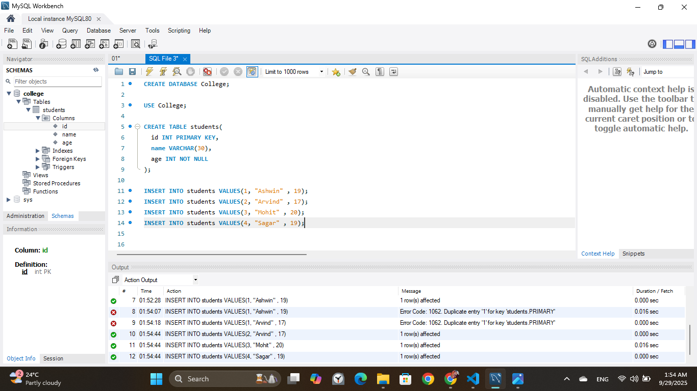
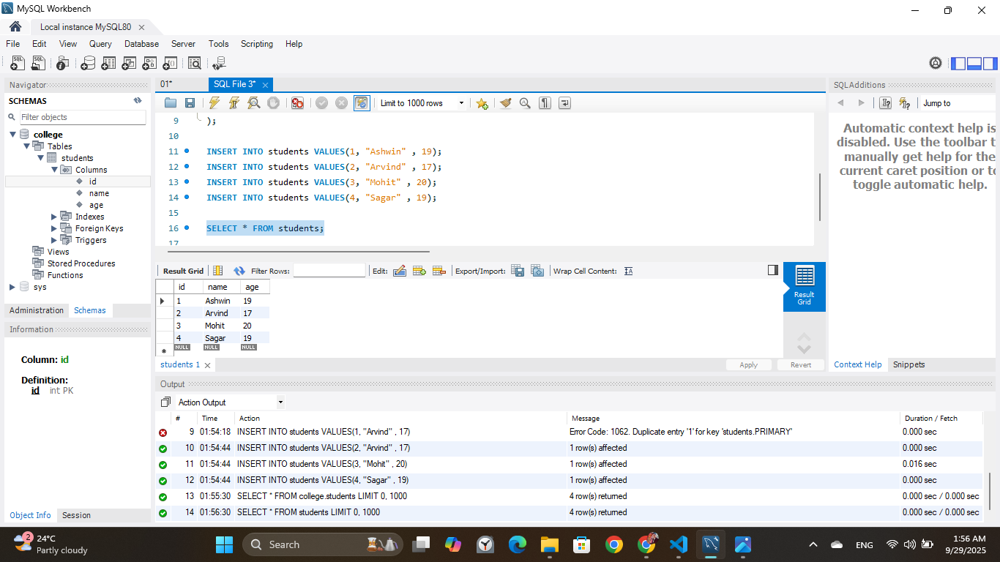
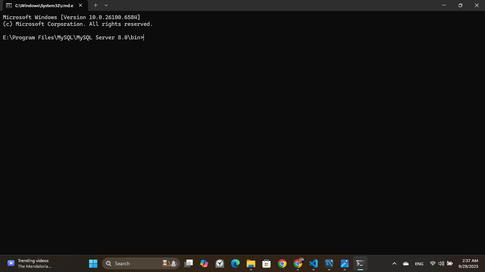
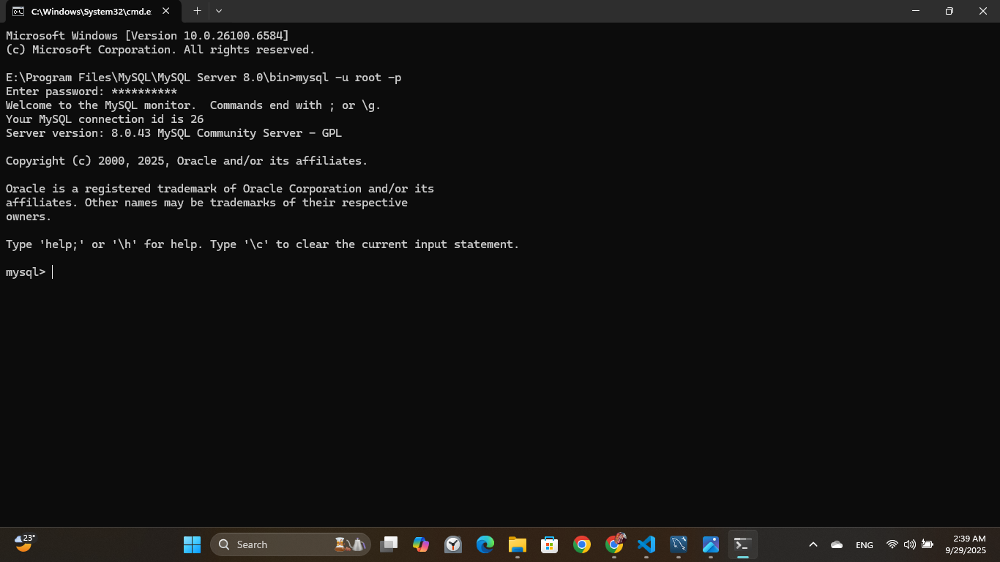
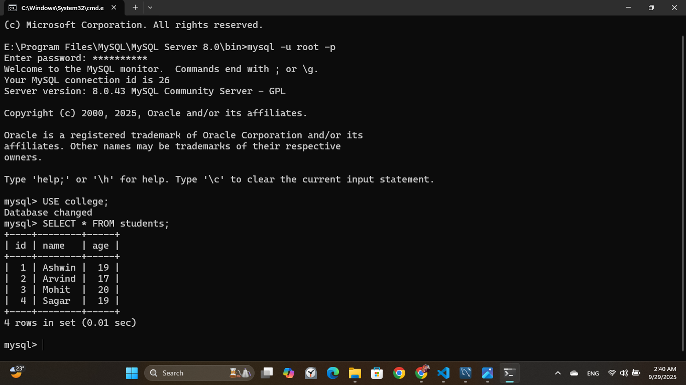

# Database

A **database** is an organized collection of data that is stored and accessed electronically. Databases are designed to efficiently store, manage, and retrieve large amounts of information. They are commonly used in various applications, from websites and business systems to scientific research and mobile apps.

## Key Characteristics

- **Structured Data**: Data is stored in a structured format, often using tables, rows, and columns.
- **Efficient Access**: Databases support quick search, insert, update, and delete operations.
- **Data Integrity**: Rules and constraints ensure accuracy and consistency of data.
- **Security**: Access controls protect data from unauthorized access or modification.

## Types of Databases

- **Relational Databases (RDBMS)**: Store data in tables (e.g., MySQL, PostgreSQL, Oracle).
- **NoSQL Databases**: Store unstructured or semi-structured data (e.g., MongoDB, Cassandra).
- **In-Memory Databases**: Store data in RAM for faster access (e.g., Redis).
- **Cloud Databases**: Hosted on cloud platforms (e.g., Amazon RDS, Google Cloud Firestore).

## Common Uses

- Managing customer information in businesses
- Storing content for websites and apps
- Handling transactions in banking systems
- Analyzing data for research or business intelligence


# DBMS (Database Management System)

A **Database Management System (DBMS)** is software that allows users to define, create, maintain, and control access to a database. It serves as an interface between the database and the users or application programs, ensuring that data is consistently organized and easily accessible.

## Key Functions of a DBMS

- **Data Storage and Retrieval**: Efficiently stores data and allows users to retrieve it using queries.
- **Data Manipulation**: Supports operations such as inserting, updating, deleting, and querying data.
- **Data Security**: Controls user access to sensitive data.
- **Data Integrity**: Enforces rules to maintain accuracy and consistency.
- **Backup and Recovery**: Provides tools to back up data and restore it after failures.

## Components of a DBMS

- **Database Engine**: Handles data storage, retrieval, and updates.
- **Database Schema**: Defines the structure (tables, fields, relationships).
- **Query Processor**: Interprets and executes SQL queries.
- **Transaction Manager**: Manages transactions and concurrency control.
- **Metadata Catalog**: Stores information about the database structure and constraints.

## Examples of Popular DBMS Software

- **MySQL**
- **PostgreSQL**
- **Oracle Database**
- **Microsoft SQL Server**
- **MongoDB** *(for NoSQL databases)*

## Advantages of Using a DBMS

- Reduces data redundancy
- Improves data sharing and security
- Provides centralized data management
- Ensures data integrity and consistency

# Relationship Between User, DBMS, and Database

The DBMS acts as a bridge between the user and the database. Users do not interact with the database directly — they interact with the DBMS, which manages all data access and operations.

## Diagram:

        +--------+       
        |  User  |       
        +--------+       
             |            
             | interacts with
             v            
        +-----------+     
        |   DBMS    | <------ Software layer
        +-----------+     
             |            
             | accesses / manages
             v            
        +------------+    
        |  Database  | <--- Stores actual data
        +------------+    

## Description:

- **User**: Any person or application that needs to access or manipulate data.
- **DBMS**: Software that processes user requests (e.g., SQL queries) and communicates with the database.
- **Database**: The actual storage of data, structured in tables, documents, etc.
- 

<hr>

# Types Of Databases Mainly

## 1. Relational Database (RDBMS)

- **Description**: Stores data in tables (rows and columns) with predefined schemas.
- **Example Systems**: MySQL, PostgreSQL, Oracle, Microsoft SQL Server
- **Use Cases**: Banking systems, e-commerce, ERP, CRM

---

## 2. NoSQL Database (Non - Relational)

- **Description**: Designed for unstructured, semi-structured, or rapidly changing data. Does not use traditional table-based schema.
- **Types**:
  - **Document-based**: e.g., MongoDB
  - **Key-value stores**: e.g., Redis
  - **Column-family stores**: e.g., Cassandra
  - **Graph databases**: e.g., Neo4j
- **Use Cases**: Real-time analytics, social networks, IoT, big data applications


# SQL 

## Introduction

This project contains a collection of SQL scripts designed to manage and interact with a relational database. It includes scripts for creating database schemas, inserting sample data, and performing common queries to retrieve and analyze information. The purpose of this project is to provide a clear and reusable set of SQL commands that can be used for learning, development, or as a starting point for building more complex database applications.

Whether you are a beginner looking to understand SQL basics or an experienced developer needing ready-to-use scripts, this project offers a practical and well-organized resource.


SQL Create database Commands

```markdown
CREATE DATABASE db_name;
```
<hr>

SQL Drop or Delete database Commands 

```markdown
DROP DATABASE db_name;
```
<hr>



<hr>


Use Database 

```markdown
USE db_name;
```

<hr>




<hr>

## Create First Database Table 

Step: 1 

```markdown
USE db_name
```

<hr>

Step: 2

```markdown
CREATE TABLE table_name(
    column_name_1 datatype constraint,
    column_name_2 datatype constraint,
    column_name_3 datatype constraint
);
```

<hr>

Example :

```markdown
USE College;
```

```markdown
CREATE TABLE students(
  id INT PRIMARY KEY,
  name VARCHAR(30),
  age INT NOT NULL
);
```

First We a define Columns
Like id, name ,age


## 🗂️ Table: `Users`

| id | name    | age |
|----|---------|-----|
|    |         |     |
|    |         |     |
|    |         |     |
----------------------

### 📄 Column Descriptions

- **id**: `INT` — Unique identifier for each user (Primary Key)
- **name**: `VARCHAR(100)` — Name of the user
- **age**: `INT` — Age of the user

<hr>



<hr>

## Insert Data into the Table

### 📝 Insert Data into `Users` Table

### Method 1 

```markdown
INSERT INTO Users (id, name, age) VALUES
(1, 'Alice', 25),
(2, 'Bob', 30),
(3, 'Charlie', 28);
```
<hr>

### Method 2

```markdown
INSERT INTO students VALUES(1, "Ashwin" , 19);
INSERT INTO students VALUES(2, "Arvind" , 17);
INSERT INTO students VALUES(3, "Mohit" , 20);
INSERT INTO students VALUES(4, "Sagar" , 19);
```


<hr>


---

### 🔎 What This Does:

- Inserts three rows into the `Users` table.
- Each row includes:
  - `id` (an integer),
  - `name` (a string),
  - `age` (an integer).

## 🗂️ Table: `Users`

| id | name    | age |
|----|---------|-----|
| 1  | Alice   | 25  |
| 2  | Bob     | 30  |
| 3  | Charlie | 28  |


<hr>



<hr>

## Show table 

```markdown
SELECT * FROM students;
```



# 📊 SQL Data Types with Examples

SQL supports various data types, grouped into categories. Here are the most common ones with examples:

---

## 1. 🔢 Numeric Data Types

| Data Type | Description                  | Example           |
|-----------|------------------------------|-------------------|
| `INT`     | Integer numbers              | `25`, `-100`      |
| `FLOAT`   | Floating-point numbers       | `3.14`, `-0.5`    |
| `DECIMAL(p, s)` | Fixed precision         | `DECIMAL(5,2)` → `123.45` |
| `SMALLINT`| Smaller range of integers    | `32000`           |
| `BIGINT`  | Larger range of integers     | `9223372036854775807` |

---

## 2. 📝 String/Text Data Types

| Data Type    | Description                    | Example             |
|--------------|--------------------------------|---------------------|
| `CHAR(n)`    | Fixed-length string            | `CHAR(5)` → `'Hi  '` |
| `VARCHAR(n)` | Variable-length string         | `VARCHAR(100)` → `'Alice'` |
| `TEXT`       | Large text data                | `'This is a long note.'` |

---

## 3. 📅 Date & Time Data Types

| Data Type     | Description                  | Example                  |
|---------------|------------------------------|--------------------------|
| `DATE`        | Stores date only             | `'2025-09-29'`           |
| `TIME`        | Stores time only             | `'14:30:00'`             |
| `DATETIME`    | Stores date and time         | `'2025-09-29 14:30:00'`  |
| `TIMESTAMP`   | Stores date & time with zone | `'2025-09-29 14:30:00+00'` |

---

## 4. ✅ Boolean Data Type

| Data Type | Description         | Example   |
|-----------|---------------------|-----------|
| `BOOLEAN` | True or false values | `TRUE`, `FALSE` |

---

## 5. 📦 Example Table Using Various Data Types

```sql
CREATE TABLE Employees (
    id INT PRIMARY KEY,
    name VARCHAR(100),
    salary DECIMAL(10,2),
    birth_date DATE,
    is_active BOOLEAN
);
```


# 🧩 Types of SQL Commands

SQL commands are categorized into **five main types**, each serving a specific purpose in database operations.

---

## 1. 📄 DDL – Data Definition Language

These commands define the structure of a database (tables, schemas, etc.).

| Command     | Description                           | Example |
|-------------|---------------------------------------|---------|
| `CREATE`    | Creates a new table or database       | `CREATE TABLE Users (...);` |
| `ALTER`     | Modifies an existing table structure  | `ALTER TABLE Users ADD age INT;` |
| `DROP`      | Deletes a table or database           | `DROP TABLE Users;` |
| `TRUNCATE`  | Removes all records from a table      | `TRUNCATE TABLE Users;` |

---

## 2. ✏️ DML – Data Manipulation Language

These commands are used to manage data within tables.

| Command    | Description                    | Example |
|------------|--------------------------------|---------|
| `INSERT`   | Adds new records               | `INSERT INTO Users VALUES (1, 'Alice', 25);` |
| `UPDATE`   | Modifies existing records      | `UPDATE Users SET age = 26 WHERE id = 1;` |
| `DELETE`   | Removes records                | `DELETE FROM Users WHERE id = 1;` |

---

## 3. 🔍 DQL – Data Query Language

Used to fetch data from the database.

| Command   | Description           | Example |
|-----------|-----------------------|---------|
| `SELECT`  | Retrieves data         | `SELECT * FROM Users;` |

---

## 4. 🔐 DCL – Data Control Language

Used to control access to data.

| Command   | Description                      | Example |
|-----------|----------------------------------|---------|
| `GRANT`   | Gives user access privileges     | `GRANT SELECT ON Users TO user1;` |
| `REVOKE`  | Removes access privileges        | `REVOKE SELECT ON Users FROM user1;` |

---

## 5. 🔁 TCL – Transaction Control Language

Manages transactions in a database (used with DML).

| Command     | Description                            | Example |
|-------------|----------------------------------------|---------|
| `COMMIT`    | Saves all changes                      | `COMMIT;` |
| `ROLLBACK`  | Reverts changes if something goes wrong| `ROLLBACK;` |
| `SAVEPOINT` | Sets a point to roll back to           | `SAVEPOINT sp1;` |

---

## 📝 Example SQL Transaction

```sql
BEGIN;

INSERT INTO Users (id, name, age) VALUES (4, 'Diana', 22);

SAVEPOINT before_update;

UPDATE Users SET age = 23 WHERE id = 4;

ROLLBACK TO before_update;

COMMIT;
```

<hr>

# 💻 SQL Command Line Usage Guide (Inside SQL Shell)
<hr>



<hr>

```markdown
mysql -u root -p
```

<hr>

USE :
Enter Password and Make it Connections


<hr>

Then , Enter the SQL Commands




# SQL Project Name

## Introduction

This project contains a collection of SQL scripts designed to manage and interact with a relational database. It includes scripts for creating database schemas, inserting sample data, and performing common queries to retrieve and analyze information. The purpose of this project is to provide a clear and reusable set of SQL commands that can be used for learning, development, or as a starting point for building more complex database applications.

Whether you are a beginner looking to understand SQL basics or an experienced developer needing ready-to-use scripts, this project offers a practical and well-organized resource.

## Keys in SQL

This project uses several types of keys to ensure data integrity and establish relationships between tables:

- **Primary Key (PK):**  
  *A unique identifier for each record in a table.
  
  *It cannot be null and ensures each row is uniquely identifiable.

- **Foreign Key (FK):**  
  *A field (or collection of fields) in one table that refers to the primary key in another table.
  
  *It enforces referential integrity between the two tables.

- **Unique Key:**  
  Ensures that all values in a column are distinct across the table, but unlike primary keys, it can accept null values depending on the database.

- **Composite Key:**  
  A primary key consisting of two or more columns that together uniquely identify a record.

# Constraints in SQL

Constraints are rules applied to table columns to ensure the accuracy and reliability of the data in the database. Common SQL constraints include:

## NOT NULL
Ensures that a column cannot have NULL values.

## UNIQUE
Ensures all values in a column are distinct across the table.

## PRIMARY KEY
Uniquely identifies each row in a table. It combines NOT NULL and UNIQUE constraints.

## FOREIGN KEY
Ensures the value in one table matches a value in another table’s primary key column, maintaining referential integrity.

## CHECK
Ensures that values in a column satisfy a specific condition.

## DEFAULT
Sets a default value for a column when no value is specified during insertion.

```markdown
CREATE TABLE employees (
  employee_id INT PRIMARY KEY,
  email VARCHAR(100) UNIQUE NOT NULL,
  age INT CHECK (age >= 18),
  department_id INT,
  hire_date DATE DEFAULT CURRENT_DATE,
  FOREIGN KEY (department_id) REFERENCES departments(department_id)
);
```


